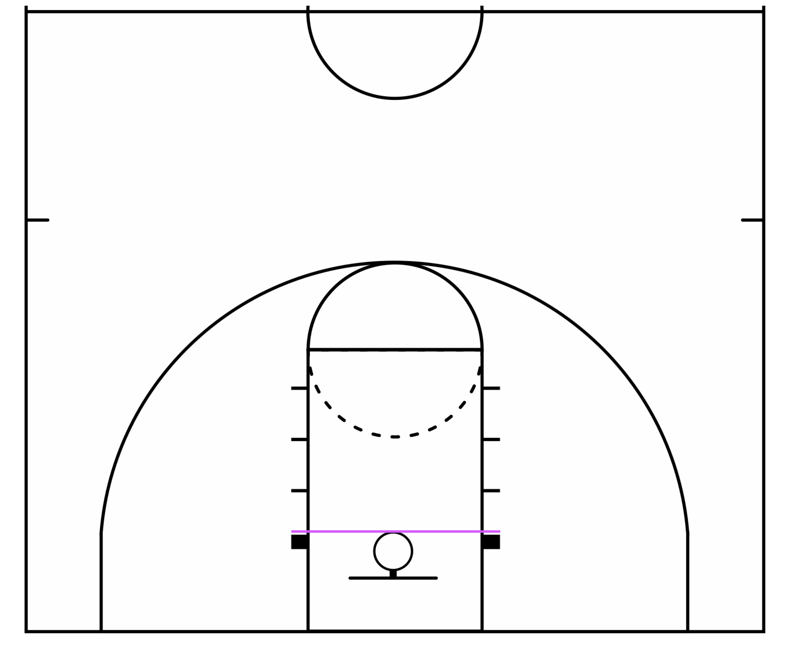

## 1. Introduction

Hi Noah, August! I hope this finds you well. Below is my favorite shooting drill. My basketball coach taught me this drill and shooting mindset a loooong time ago. Form shooting has not only improved my shooting, it has completely transformed the way I think about shooting a basketball.****

## 2. Ball Preparation
First we need to draw a line down the center of the ball.  I find it easiest to use a rubber band large enough to stretch around the basketball of your choice. There are different basketball sizes make sure to find the size that works best for the basketball you want to use.

Start by finding the air hole on the ball - use that as a guide. Your center line needs to be perpendicular to the existing grooves on the ball.

## 3. Positioning on the basketball court
- Imagine a line going from one block, to the next. [I've gone as far as drawing the line with chalk, or using a piece of tape.]

## 4. Positioning Yourself
- Toesies: If you are shooting with your right hand, put your right toe on the line. [Flip it if you are left handed]
- You can place the other foot on the line, or a little behind. I prefer a little behind the line.
- Knee: Bend your right knee so that it is over your right toe.
- Elbow: Place your elbow so that it is over your knee.
- Hand: Place your hand so that it is over your elbow.
- Imagine there is a pole going from your toes, to your knee, your elbow, and hand!

## 5. Positioning the Basketball
- First make a peace sign with your hand, and spread the rest of your fingers apart.

- Place the center of the ball directly down the center of your peace sign.

- Make sure to keep the ball on the pads of your fingers - there should be a little space between the ball and the center of your palm.

- Off hand: Place your other hand at your side, or behind your back - *for this drill, it isn't allowed to assist your dominant hand while shooting*.

**Remember**:
-- Bend your knees.
-- Always spread your fingers.
-- After shooting the ball, your arm ought to be fully extended, and palm facing down.

## 6. Target & Shooting Goals
- Some people like to focus on the front of the rim, some like the focus on the back of the rim, and some like looking at the rim as a whole. I'll let you decide what feels most comfortable.

- You want to shoot the ball with one hand, BUT HERES THE IMPORTANT PART: **Only swishes count**.

- When you can make 30 swishes in a row, move backwards to the next hash and repeat the process only aiming for swishes.

- Lastly, if you miss, or if the ball touches anything but net, you have to go back to zero.

